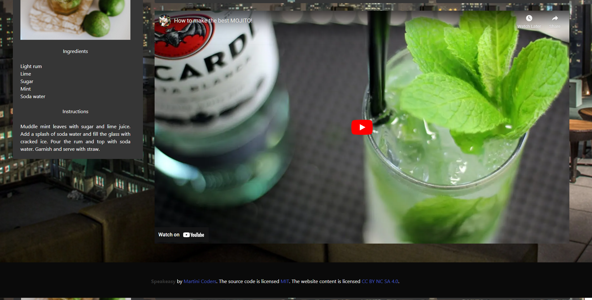

# Speakeasy

## Description

Discover classic cocktails or get information on you favorite one. See their ingredients and bio and also watch Youtube tutorials on creating them.

## Inspiration

- We were motivated to create this project because most of us (team members) have experience in beverage industry and it seemed like a good combination. 

## Benefits of building this Project

- We are definitely learning how to work as a team utilizing Github. We are also learning how to build websites utilizing APIs and hopefully building life-long relationships as well.

## Usage

Type in the name of your favorite cocktail in the search bar and see the results.

[Link to SpeakEasy](https://oliverlo78.github.io/v2-SpeakEasy-Project/)

## Technologies 

### Features:

This application has the following features:
User can search for a cocktail by entering the cocktail's name or by clicking on any of the three most popular in the home page
The application displays the cocktail with ingredients and video 
The application also displays a list of recommended cocktail for user who have not decided their cocktail
For each searched cocktail, the application shows the ingredients, exact amount for each list item, a short description of the cocktail, google's YouTube API will provide a how to video for searched cocktail
The application provides a feature for users to save their favourite cocktails/ in local storage so they can access it quickly later by clicking on favourites button
 
User Story:

As a user looking for a cocktail, I would like an application that allows me to see and cocktail recipes, as well as how to video on how to prepare your favorite cocktail. When I am on the homepage, I am presented with a list of cocktails in an easy-to-navigate area. When looking for potential cocktails to try at bar, I am presented with suggestions to help inform my decision.

## Screenshots

&nbsp;\
&nbsp;\

&nbsp;

## Credits:

### Collaborators:
    Jack Kane
    Oliver Lopez
    Craig Putzstuck
    Anderson Roman

## Third-party Assets

- Cocktail API: https://www.thecocktaildb.com/
- Youtube:  https://www.youtube.com/
- Github: https:

## License

MIT

---
